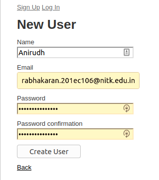
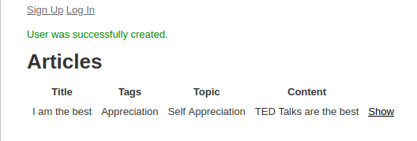
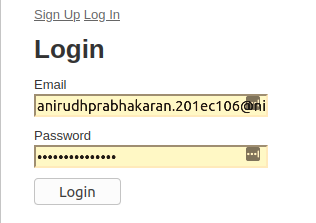
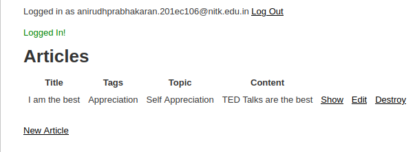
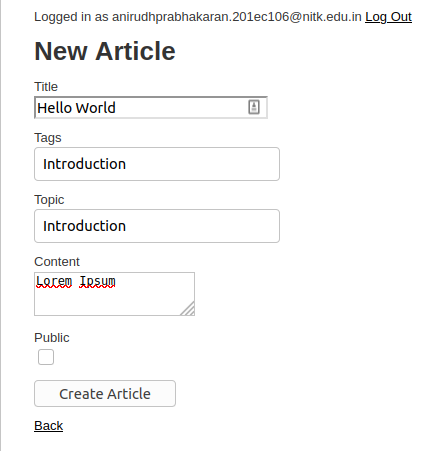
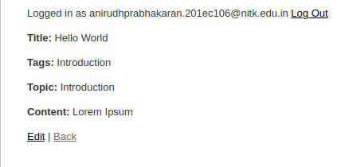
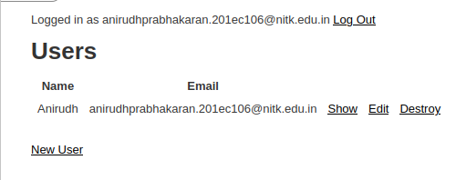
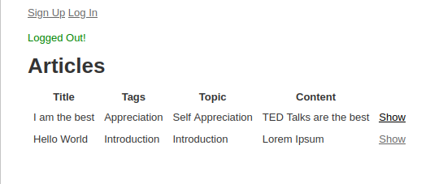

# Session 3

## Changes done
After login and logout, we are automatically redirected to `root_url` i.e. the homepage, so that we can see the articles list. After login, the options to make a new article, edit and delete old ones are also visible.

## Sign Up

## Login

## Articles

## Users

## Logout

